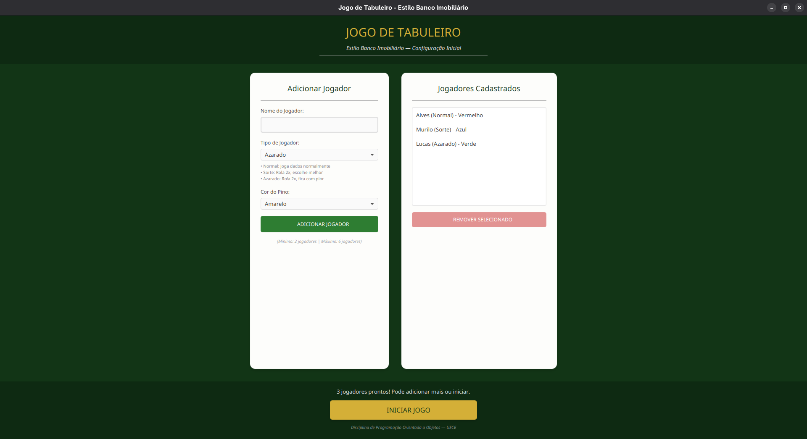
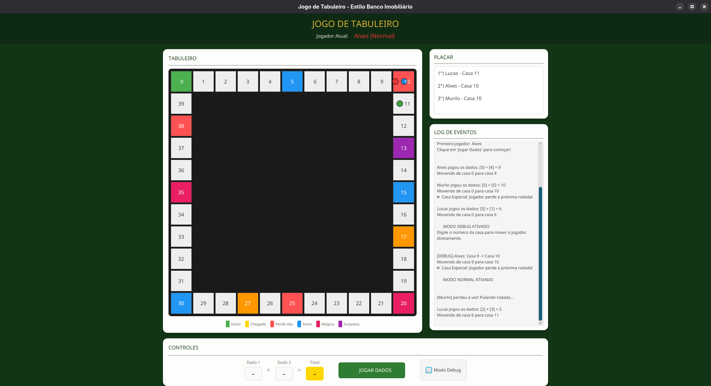

# 🎲 JOGO DE TABULEIRO - ESTILO BANCO IMOBILIÁRIO

Este é um projeto acadêmico de um **Jogo de Tabuleiro Interativo** desenvolvido para a disciplina de **Programação Orientada a Objetos (POO)** na **Universidade Estadual do Ceará (UECE)**. 

O jogo combina uma interface gráfica moderna e fluida construída em **JavaFX** com uma arquitetura estrita baseada nos pilares de POO (Herança, Polimorfismo, Encapsulamento e Abstração), utilizando o **Maven** para gerenciamento de dependências.

---

## 🚀 FUNCIONALIDADES PRINCIPAIS

* **Tabuleiro Dinâmico 11x11:** Uma pista quadrada com 40 casas dispostas ao redor de um painel central limpo e intuitivo.
* **Customização de Jogadores:** Suporte para 2 a 6 jogadores simultâneos com escolha de nomes, cores dos pinos e tipos de personalidade.
* **Sistema de Log e Placar em Tempo Real:** Acompanhamento instantâneo das posições dos jogadores, rodadas passadas e eventos especiais.
* **Painel de Controles:** Lógica de rolagem de dados visual com cálculo de soma automática e transição de turnos.
* **Modo Debug Integrado:** Uma ferramenta para testar mecânicas de jogo saltando diretamente para qualquer casa do tabuleiro (0 a 40).

---

## 🧬 OS PILARES DE POO APLICADOS

O projeto foi estruturado seguindo o padrão arquitetural **MVC (Model-View-Controller)**, separando de forma clara a interface gráfica das regras de negócio:

### 1. Polimorfismo e Herança (`Model`)
O jogo implementa regras customizadas de comportamento através de classes especializadas:

* **Tipos de Jogadores (`Jogador`):**
  * `JogadorNormal`: Rolagem de dados puramente aleatória.
  * `JogadorSorte`: Sorte estrita! A soma dos dados é forçada por validação a ser **sempre >= 7**.
  * `JogadorAzarado`: Azar garantido! A soma dos dados é validada para ser **sempre <= 6**.
* **Tipos de Casas (`Casa`):**
  * `CasaSimples`: Casa de passagem regular.
  * `CasaPerdeVez`: Prende o jogador, forçando-o a pular a próxima rodada.
  * `CasaSorte`: Concede bônus avançando o pino algumas posições.
  * `CasaMagica`: Troca de posição no tabuleiro com o jogador mais próximo.
  * `CasaSurpresa`: Sorteia uma carta aleatória alterando o status do jogador.

### 2. Encapsulamento e Abstração
Todos os atributos das entidades (como status, posição, nome e modificadores de estado) são protegidos, sendo expostos estritamente por métodos assessores (`getters`/`setters`) e executando validações internas robustas por meio de laços de controle `do-while` internos para blindar as regras de negócio dos dados.

---

## 🖥️ INTERFACE GRÁFICA (UI/UX)

A interface foi projetada visando harmonia visual e prevenção de transbordo em telas convencionais:
* **Visual Boarding:** Fundo em verde-tabuleiro clássico (`#123516`) com tipografia elegante e destaques dourados (`#D4AF37`).
* **Grid Geométrico:** O tabuleiro possui dimensões fixas quadradas de 670x670 pixels eliminando distorções de proporção.
* **Controles Consolidados:** O painel inferior estende-se horizontalmente por toda a janela, agrupando os dados, os botões de ação e a caixa embutida do **Modo Debug** no mesmo alinhamento.

## 🖥️ TELA INICIAL

---

## 🎮 JOGO RODANDO

---

## 🛠️ TECNOLOGIAS UTILIZADAS

* **Linguagem:** Java 17 / Java 25
* **Framework Gráfico:** JavaFX 17 (com arquivos de layout `.fxml` e estilização via `CSS`)
* **Gerenciador de Projeto:** Maven (configurado via `pom.xml`)
* **Ambientes Compatíveis:** IntelliJ IDEA, Apache NetBeans, Linux Fedora (via terminal), e todos que tiverem bem configurados

---

## 🏃 Para Executar o Projeto

Certifique-se de ter o **Maven** e um **JDK** compatível instalados em sua máquina.

*Desenvolvido com fins acadêmicos para a UECE. 🎲✨*
